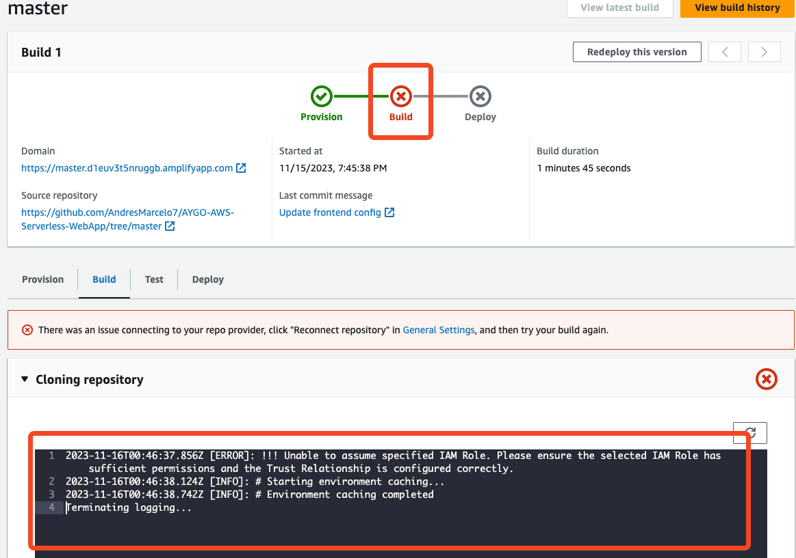

# AYGO WORKSHOP - SERVERLESS REFERENCE ARCHITECTURE: WEB APPLICATION

In this project we'll take a look of the process creation and deployment of an API integrated with Cognito for user authentication and management, the purpouse of this workshop is to understand how to impleent authentication/authorization using AWS Service Cognito implementing a basic Todo web application.

# Workshop Evidence

[The evidence of the created resources and the app working with cognito is in this link](https://youtu.be/MGFfokZL1Z8)

## Before we start

This project is forked from [AWS samples Repository](https://github.com/aws-samples/lambda-refarch-webapp) and implementing using an AWS Educate account, so during the implementation of this project I found some limitations that the authors do not mention.

### Limitations

* With an AWS Educate Account, if you use the LabRole for the deployment, it denies access to take the resources when deploying the frontend:
 
So its easier to test it using a personal account or testing it from local environment.

* With an AWS Educate Account, you have to explicitly declare the role you would use extracting the ARN from the account, if you dont do that, the [AWS SAM template](./template.yml) will fail when deploying because you dont have permission to create Roles.

* Make sure you use lowercase naming the stack and avoid special characters, the [AWS SAM template](./template.yml) will create resources using that name.

* If you fork the original repository -> [AWS samples Repository](https://github.com/aws-samples/lambda-refarch-webapp) check the nodeJS code, because some parts of the code make calls to functions that dont match their parameters, in this repository, the code is corrected.


# AWS Documentation for the workshop 

README Languages: 
[PT](README/README-PT.md) 

## Introduction
The Web Application reference architecture is a general-purpose, event-driven, web application back-end that uses [AWS Lambda](https://aws.amazon.com/lambda), [Amazon API Gateway](https://aws.amazon.com/apigateway) for its business logic. It also uses [Amazon DynamoDB](https://aws.amazon.com/dynamodb) as its database and [Amazon Cognito](https://aws.amazon.com/cognito) for user management. All static content is hosted using [AWS Amplify Console](https://aws.amazon.com/amplify/console).

This application implements a simple To Do app, in which a registered user can create, update, view the existing items, and eventually, delete them.

## Architectural Diagram


## Application Components

The Web Application is built from 3 different components.

### Front End Application

The front-end application is all the static content (HTML files, CSS files, JavaScript files and images) that are generated by `create-react-app`. All these objects are hosted on AWS Amplify Console.

When a user connects to the web site, the needed resources are downloaded to their browser and start to run there. When the application needs to communicate with the backend it does so by issuing REST API calls to the backend.

### Back End Application (Business Logic)

The backend application is where the actual business logic is implemented. The code is implemented using Lambda functions fronted by an API Gateway REST API. In our case, we have different Lambda functions, each handling a different aspect of the application: list the to-do items, get details about a specific item, update an item, create a new item, mark an item as complete and delete an existing item. The application saves all items in a DynamoDB table.

### User Registration and Authentication

As the ToDo application contains personal information (the user's ToDo items), access is restricted only to registered and authenticated users. Each user can access only their own items.

To accomplish this, we are using Cognito User Pools, which allows users to register to the application, authenticate and so on. Only after a user is authenticated, the client will receive a JWT token which it should then use when making the REST API calls.

## Running the Example

Fork this repository to your own GitHub account, as you will need to create a Personal Access Token in Github for the Amplify console, as well as provide your GitHub repository URL in the deployment.

You can use the provided [AWS SAM template](./template.yml) to launch a stack that shown here on this Serverless reference architecture. Details about the resources created by this template are provided in the *SAM Template Resources* section of this document.

## Generating your Github Access Token

In order for use the Amplify Console, you need to generate a personal access token.
Once created, an access token should be stored in a safe place, as it may not be available to be seen the next time and may need to regenerate a new one again.
In order to setup your access token, go to [New personal access page](https://github.com/settings/tokens/new) in GitHub.

Note that you might need to enter your password in order to proceed.

### Using SAM and the Amplify Console to Build and Deploy the Full Stack Application

You can deploy the full stack application using the deployment script:

```bash
export AWS_DEFAULT_REGION=<your preferred region, i.e. us-east-1>
export STACK_NAME=<a unique name for your CloudFormation stack>
./deploy.sh
```

The script will use the SAM CLI to build your backend functions, and then the guided deployment feature of the SAM CLI for the initial backend deployment. You will be prompted for a set of parameters, and can accept the defaults for all parameters with the exception of the GitHub Repository URL and the GitHub OAuth token.

#### Deploy the backend

This command deploys your application to the AWS Cloud. It's important that this command explicitly includes both of the following:

* The AWS Region to deploy to. This Region must match the Region of the Amazon S3 source bucket.

* The CAPABILITY_IAM parameter, because creating new Lambda functions involves creating new IAM roles.

```bash
sam deploy \
    --template-file packaged.yml \
    --stack-name $STACK_NAME \
    --capabilities CAPABILITY_IAM
```


#### Updating the Front-End Application

Once you deploy the infrastructure using SAM you will need to create a configuration file for your front-end web application. You can view the necessary values by describing your deployed stack:

```bash
aws cloudformation describe-stacks --stack-name $STACK_NAME --query "Stacks[0].Outputs[]"
```

Copy the default config file and update the values from the output above:

```bash
cp www/src/config.default.js www/src/config.js
```

You can run the front end locally for testing by setting the `redirect_url` value to `https://localhost:8080` and running:

```bash
cd www/src
npm start
```

You can run the front end locally for testing and use the local api by setting the `api_base_url` value to `http://127.0.0.1:8080`

#### Deploy the frontend

Deploy your application by checking in your update to the `config.js` file and pushing that commit to your repo. Amplify Console will automatically deploy the update from there.

```bash
git add www/src/config.js
git commit -m 'Update frontend config'
git push
```

You can view the deployment process in the Amplify Console web console.

## Cleaning Up the Example Resources

### Delete the CloudFormation Stack

```bash
aws cloudformation delete-stack \
--stack-name $STACK_NAME
```

### Delete the CloudWatch Log Groups

```bash
for log_group in $(aws logs describe-log-groups --log-group-name-prefix '/aws/lambda/'$STACK_NAME --query "logGroups[*].logGroupName" --output text); do
  echo "Removing log group ${log_group}..."
  aws logs delete-log-group --log-group-name ${log_group}
  echo
done
```

## SAM Template Resources

### Resources

[The provided template](./template.yaml)
creates the following resources:

* **TodoUserPool** - A Cognito UserPool that holds all the application users

* **TodoUserPoolTokenClient** - A Cognito UserPool Client used by the web application

* **TodoDomain** - The Cognito UserPool domain name

* **TodoTable** - The DynamoDB table used to hold all the ToDo items for all users

* **TodoApi** - The REST API that is used to expose the ToDo application functionality

* **GetTodoFunction** - The Lambda function used to retrieve a single ToDo item

* **GetAllTodoFunction** - The Lambda function used to retrieve all the ToDo items

* **CompleteTodoFunction** - The Lambda function used to set the state of an item to complete

* **AddTodoFunction** - The Lambda function used to create a new ToDo item

* **UpdateTodoFunction** - The Lambda function used to update the content of a ToDo item

* **DeleteTodoFunction** - The Lambda function used to delete a ToDo item

* **ApiGatewayPushToCloudWatchRole** - An IAM role that allows API Gateway to send log events to CloudWatch Logs

* **ApiAccessLogGroup** - The CloudWatch Logs Log Group used by API Gateway for its log messages

* **AmplifyApp** - Amplify Console application that will manage deployment of frontend updates based on pushes to GitHub

* **AmplifyBranch** - Connecting a GitHub branch to the Amplify Console application

* **AmplifyRole** - An IAM role that allows the Amplify Console to perform build and deployment actions

### Notes

By default, the default Node.js HTTP/HTTPS agent creates a new TCP connection for every new request. To avoid the cost of establishing a new connection, you can reuse an existing connection.

For short-lived operations, such as DynamoDB queries, the latency overhead of setting up a TCP connection might be greater than the operation itself. Additionally, since DynamoDB [encryption at rest](https://docs.aws.amazon.com/amazondynamodb/latest/developerguide/encryption.howitworks.html) is integrated with [AWS KMS](https://docs.aws.amazon.com/amazondynamodb/latest/developerguide/encryption.howitworks.html), you may experience latencies from the database having to re-establish new AWS KMS cache entries for each operation.

The easiest way to configure SDK for JavaScript to reuse TCP connections is to set the `AWS_NODEJS_CONNECTION_REUSE_ENABLED` environment variable to 1. This feature was added in the [2.463.0](https://github.com/aws/aws-sdk-js/blob/master/CHANGELOG.md#24630) release.

Read more about this feature on our [Developer Guide](https://docs.aws.amazon.com/sdk-for-javascript/v2/developer-guide/node-reusing-connections.html).

## Well-Architected Review

We have conducted a [Well-Architected](https://aws.amazon.com/architecture/well-architected/) review for this application using the [Serverless Application Lens](https://d1.awsstatic.com/whitepapers/architecture/AWS-Serverless-Applications-Lens.pdf). The results of this review can be found [here](well-architected.md).

## License

This reference architecture sample is licensed under Apache 2.0.
